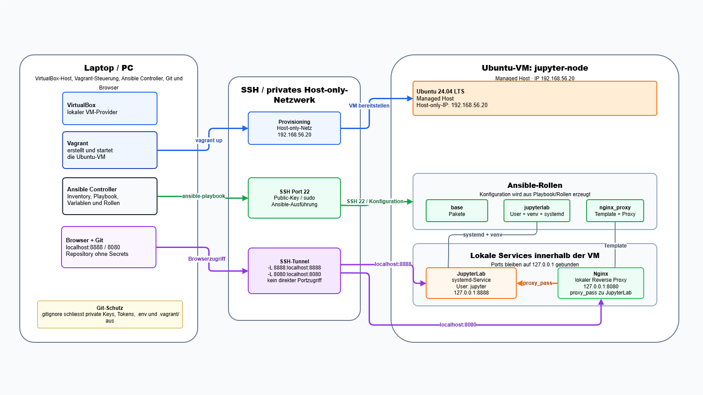
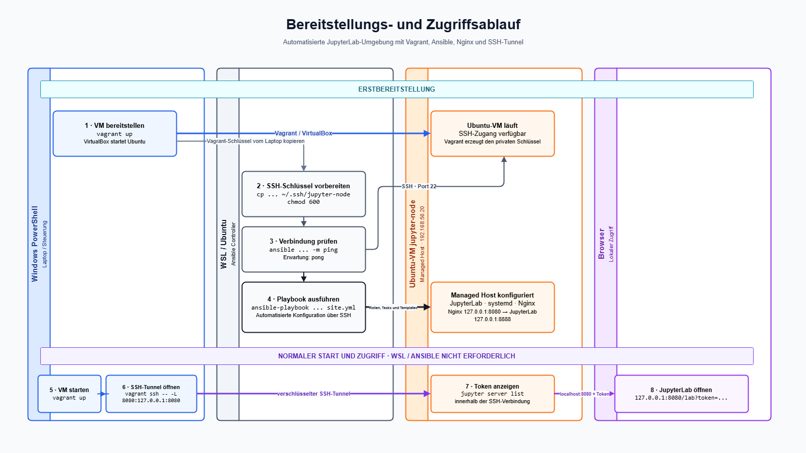

# Projektarbeit

## Automatisierte JupyterLab-Umgebung mit Ansible

**TEKO Schweizerische Fachschule Bern**  
**Modul:** Netzwerkbetriebssysteme / Automatisation mit Ansible  
**Arbeitsform:** Einzelarbeit  
**Projekt:** JupyterLab mit Ansible, Vagrant und lokalem Nginx-Reverse-Proxy  
**Managed Host:** Ubuntu-VM `jupyter-node` mit IP `192.168.56.20`

---

## 1. Ausgangslage

Für dieses Projekt soll eine kleine, reproduzierbare Umgebung mit Ansible automatisiert bereitgestellt werden. Die Aufgabenstellung verlangt zentrale Ansible-Bestandteile wie Inventory, Variablen, Playbook, Rollen und Templates.

Die Umgebung besteht aus einem Laptop/PC als Ansible Controller und einer Ubuntu-VM als Managed Host. Die VM wird mit Vagrant erstellt und danach über SSH mit Ansible konfiguriert.

## 2. Ziel

Ziel ist eine lokale JupyterLab-Umgebung, die mit wenigen Schritten reproduziert werden kann. JupyterLab wird automatisiert installiert und als systemd-Service betrieben. Zusätzlich wird Nginx als lokaler Reverse Proxy eingerichtet, um eine weitere Ansible-Rolle mit Template-Konfiguration zu zeigen.

Der Zugriff auf JupyterLab erfolgt nicht über einen öffentlich freigegebenen Port, sondern über einen SSH-Tunnel.

## 3. Architektur



*Abbildung 1: Technischer Aufbau mit Laptop, Ansible Controller, privatem Netzwerk und Ubuntu-VM als Managed Host.*

```text
Laptop / PC
Ansible Controller + Browser
        |
        | SSH Port 22
        v
Ubuntu-VM jupyter-node
├── JupyterLab: 127.0.0.1:8888
└── Nginx:      127.0.0.1:8080 -> 127.0.0.1:8888
```

Der Laptop/PC dient als VirtualBox-Host, Vagrant-Steuerung, Ansible Controller, Git-Arbeitsumgebung und Browser-Client. Die VM `jupyter-node` ist der Managed Host.

## 4. Sicherheitskonzept

JupyterLab läuft nicht als Root, sondern unter dem eigenen Benutzer `jupyter`. JupyterLab bindet nur auf `127.0.0.1:8888`. Nginx bindet nur auf `127.0.0.1:8080` und leitet lokal an JupyterLab weiter.

Die Ports `8888` und `8080` werden nicht in VirtualBox weitergeleitet. Der Zugriff erfolgt über SSH-Tunnel. Private Keys, Tokens, Passwörter, `.env`-Dateien und lokale Vagrant-Dateien werden nicht ins Git-Repository aufgenommen.

## 5. Technische Umsetzung

Das Projekt ist in Vagrant und Ansible aufgeteilt:

- `vagrant/Vagrantfile`: erstellt die Ubuntu-VM
- `ansible/inventory.ini`: definiert den Managed Host
- `ansible/group_vars/all.yml`: enthält zentrale Variablen
- `ansible/site.yml`: führt die Rollen aus
- `roles/base`: installiert Basispakete
- `roles/jupyterlab`: installiert und betreibt JupyterLab
- `roles/nginx_proxy`: konfiguriert Nginx als lokalen Reverse Proxy

Die systemd- und Nginx-Konfigurationen werden über Templates erzeugt.

## 6. Reproduktion der Umgebung



*Abbildung 2: Ablauf der Erstbereitstellung mit Vagrant und Ansible sowie des späteren Browserzugriffs über den SSH-Tunnel.*

### 6.1 Voraussetzungen

Die getestete Referenzumgebung verwendet:

- Windows 10 oder Windows 11
- Git
- VirtualBox
- Vagrant
- WSL mit Ubuntu
- Ansible innerhalb von WSL

Windows PowerShell wird für Vagrant verwendet. WSL dient als Ansible Controller und die Ubuntu-VM `jupyter-node` als Managed Host. Unter Linux oder macOS kann Ansible direkt installiert werden, wodurch WSL entfällt. Ein reines Windows-System ohne WSL oder einen anderen Linux-basierten Ansible Controller wird nicht unterstützt.

### 6.2 Repository herunterladen – Windows PowerShell

```powershell
git clone https://github.com/lucastoney/jupyter-ansible-projekt.git
cd jupyter-ansible-projekt
```

### 6.3 WSL bei Bedarf installieren – Windows PowerShell als Administrator

```powershell
wsl --install -d Ubuntu
```

Nach der Installation muss Windows gegebenenfalls neu gestartet werden. Beim ersten Start von Ubuntu werden ein Linux-Benutzername und ein Passwort festgelegt.

### 6.4 Ansible installieren – WSL

```bash
sudo apt update
sudo apt install -y ansible
ansible --version
```

### 6.5 VM erstellen und starten – Windows PowerShell

Im geklonten Repository:

```powershell
cd vagrant
vagrant up
vagrant status
```

Erwartete Ausgabe:

```text
jupyter-node running
```

Vagrant erstellt die Ubuntu-VM und erzeugt automatisch den benötigten SSH-Schlüssel.

### 6.6 Projekt in WSL öffnen

Der genaue Pfad muss an den Speicherort des Repositorys angepasst werden:

```bash
cd /mnt/c/PFAD/ZUM/jupyter-ansible-projekt
ls
```

Unter anderem sollten die Ordner `ansible` und `vagrant` sichtbar sein.

### 6.7 SSH-Schlüssel vorbereiten – WSL

```bash
mkdir -p ~/.ssh
cp vagrant/.vagrant/machines/jupyter-node/virtualbox/private_key ~/.ssh/jupyter-node
chmod 600 ~/.ssh/jupyter-node
```

Der Schlüssel wird lokal von Vagrant erzeugt und nicht im Git-Repository gespeichert.

### 6.8 Verbindung zum Managed Host prüfen – WSL

```bash
ANSIBLE_HOST_KEY_CHECKING=False ansible all \
  -i ansible/inventory.ini \
  -m ping \
  -e "ansible_ssh_private_key_file=$HOME/.ssh/jupyter-node"
```

Erwartete Ausgabe:

```text
jupyter-node | SUCCESS
"ping": "pong"
```

### 6.9 Playbook ausführen – WSL

```bash
ANSIBLE_HOST_KEY_CHECKING=False ansible-playbook \
  -i ansible/inventory.ini \
  ansible/site.yml \
  -e "ansible_ssh_private_key_file=$HOME/.ssh/jupyter-node"
```

Die Bereitstellung ist erfolgreich, wenn die Zusammenfassung Folgendes enthält:

```text
unreachable=0
failed=0
```

### 6.10 SSH-Tunnel öffnen – Windows PowerShell

In einem neuen PowerShell-Fenster innerhalb des Repositorys:

```powershell
cd vagrant
vagrant ssh -- -L 8080:127.0.0.1:8080
```

Dieses Fenster muss während der Verwendung geöffnet bleiben.

### 6.11 Jupyter-Token anzeigen – Ubuntu-VM

Im geöffneten SSH-Fenster:

```bash
sudo -u jupyter env HOME=/opt/jupyterlab \
  /opt/jupyterlab/venv/bin/jupyter server list
```

Die Ausgabe enthält eine lokale Adresse mit einem temporären Token:

```text
http://127.0.0.1:8888/?token=BEISPIELTOKEN
```

### 6.12 JupyterLab öffnen – Browser auf dem Laptop

Der angezeigte Token wird in folgende Adresse eingesetzt:

```text
http://127.0.0.1:8080/lab?token=BEISPIELTOKEN
```

### 6.13 Umgebung beenden

Zuerst wird die SSH-Verbindung geschlossen:

```bash
exit
```

Danach wird die VM im bereits geöffneten Ordner `vagrant` in Windows PowerShell heruntergefahren:

```powershell
vagrant halt
```

Beim nächsten Start genügt `vagrant up`. Das Playbook muss erneut ausgeführt werden, wenn die VM neu erstellt oder die Ansible-Konfiguration geändert wurde.

## 7. Funktionsnachweis

Die folgenden Befehle werden in Windows PowerShell im Ordner `vagrant` ausgeführt.

JupyterLab-Service prüfen:

```powershell
vagrant ssh -c "sudo systemctl status jupyterlab --no-pager"
```

Nginx-Service prüfen:

```powershell
vagrant ssh -c "sudo systemctl status nginx --no-pager"
```

Portbindung prüfen:

```powershell
vagrant ssh -c "sudo ss -tulpen | grep -E '8888|8080'"
```

Erwartung:

```text
127.0.0.1:8888
127.0.0.1:8080
```

Nicht erwartet:

```text
0.0.0.0:8888
0.0.0.0:8080
```

SSH-Tunnel direkt zu JupyterLab öffnen:

```powershell
vagrant ssh -- -L 8888:127.0.0.1:8888
```

Browser:

```text
http://127.0.0.1:8888
```

Alternativ den SSH-Tunnel über Nginx öffnen:

```powershell
vagrant ssh -- -L 8080:127.0.0.1:8080
```

Browser:

```text
http://127.0.0.1:8080
```

Das jeweilige PowerShell-Fenster muss während des Browserzugriffs geöffnet bleiben. Falls eine Anmeldung verlangt wird, kann der aktuelle Jupyter-Token innerhalb der geöffneten SSH-Verbindung angezeigt werden:

```bash
sudo -u jupyter env HOME=/opt/jupyterlab \
  /opt/jupyterlab/venv/bin/jupyter server list
```

## 8. Demo-Ablauf

1. Repository und Architekturzeichnung zeigen.
2. VM mit `vagrant up` starten.
3. SSH-Verbindung mit `vagrant ssh` prüfen.
4. Ansible Ping ausführen.
5. Playbook ausführen.
6. Services und lokale Portbindung prüfen.
7. SSH-Tunnel starten.
8. JupyterLab im Browser öffnen.
9. Beispiel-Notebook ausführen.

## 9. Probleme und Lösungen

Wenn Ansible keinen SSH-Zugriff erhält, wurde die VM möglicherweise noch nicht mit `vagrant up` erstellt. In diesem Fall muss zuerst die VM im Ordner `vagrant/` gestartet werden.

Wenn JupyterLab im Browser nicht erreichbar ist, muss geprüft werden, ob der SSH-Tunnel noch aktiv ist und ob der Dienst auf `127.0.0.1:8888` läuft.

## 10. Fazit

Das Projekt zeigt eine klassische Ansible-Architektur mit Controller und Managed Host. Die Umgebung ist bewusst schlank gehalten und kann mit Vagrant und Ansible reproduziert werden. JupyterLab und Nginx bleiben lokal gebunden, wodurch der Zugriff kontrolliert über SSH-Tunnel erfolgt.

## 11. Abgrenzung

Nicht umgesetzt werden Docker, Kubernetes, JupyterHub, öffentlicher Webzugriff, komplexe Benutzerverwaltung oder eine produktive Datenplattform. Der Fokus liegt auf einer verständlichen Ansible-Umsetzung für eine lokale Schulumgebung.
